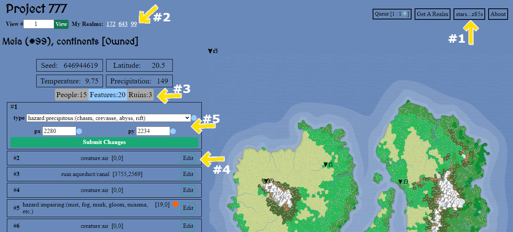
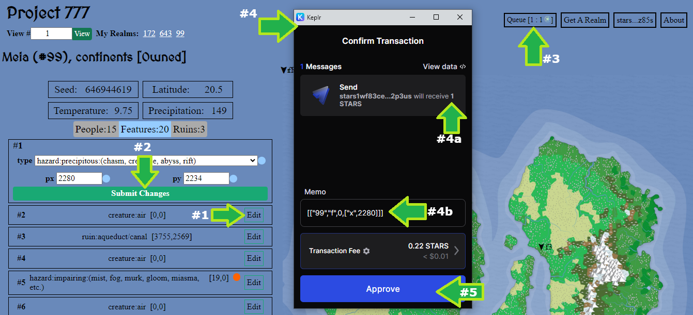

# Realms: Fantasy (Project 777)
## Deep in the 'Verse...
A ringworld spins around a standard yellow-orange star. Not a titanic ringworld that encircles the whole star, but a more mundane one. It is comprised of 777 plates each 6000 km wide and long. It only has a dameter of 1.48 million kilometers, but it has an area equivalent to 55 Earths.

It is maintained (ruled) by the Seven, a group of cosmically powered AIs, that initially seeded the ring with life so that they could play as gods. Unfortunately their first experiment didn't end well. The Cataclysm left most plates devoid of life, but the Seven have decided to try again.

You are one of their proxies, given dominion over one (or a number) of plates. While the land is established, the rest is your canvas - you will shape its features, creatures, people and it's future.

The goal of this project is to create the most interesting fantasy world that you can. There is no PvP, focus on creative world building.

[Get a Realm now on Stargaze](https://www.stargaze.zone/launchpad/stars1avmaqtmxw9g43mgpxzuhv074gmzm5wharxrvlsfp4ze7246gyqdqtr9a0l)

[You need an Ethereum Wallet and EVMOS to interact with your NFT](https://chainlist.org/?search=evmos) 

[Get EVMOS on Osmosis](https://app.osmosis.zone/?from=OSMO&to=EVMOS)

## Usage
If you own an NFT you may worldbuild (MODIFY) it. Your realm has a given number of People, Features, and Ruins. For each you can modify the following attributes.  
- Features: type and position (x,y)
- People: position (x,y)
- Ruins: position (x,y)
  
#### How to Edit your Realm
1.	Connect to Keplr (button in top right)
2.	Select the realm (“My Realms” number on top left) 
3.	Select either: People, Features or Ruins
4.	Select the item you want to edit
5.	Edit the attributes

All changes made are saved automatically to the browser, **but only you can see them**. If you want everyone to see what you have made, you may submit your changes to the EVMOS blockchain (**it costs 0.1 $EVMOS for every change submitted**).  

#### How Share Your Work
1.	Select the item you want to submit
2.	Click “Submit Changes” (you may batch submit multiple changes - just repeat steps 1&2)
3.	Click on Queue (button in the top right)
4.	An Ethereum Wallet window will open to submit a send transaction (*It costs 0.1 $EVMOS for every change submitted*).
5.	Select Approve to submit the change transaction.

### Credits
* All maps were generated using modified code from [Azgaar's Fantasy Map Generator](https://github.com/Azgaar/Fantasy-Map-Generator).
* Concept and json data created by 0xSilent
* The page was developed by 0xPaladin

### Royalties
Stargaze royalties will be adjusted based upon marketplace floor price.

| Floor ($)      | Royalties |
| ----------- | ----------- |
| <10      | 20%       |
| 10+      | 17%       |
| 16+      | 15%       |
| 20+      | 10%       |
| 50+      | 5%       |
